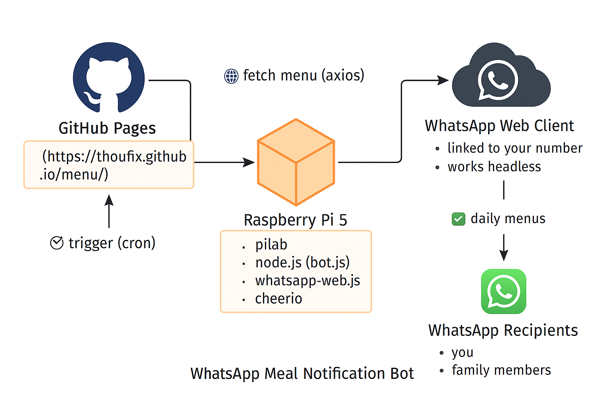

 **WhatsApp Meal Notification Bot Project** running on your **Raspberry Pi 5 (pilab)**:

---

## 🏗️ **Project Architecture**

```
+----------------------------+
|        GitHub Pages       |
|  (https://thoufix.github.io/menu/) |
| - Static HTML menu table  |
+------------+---------------+
             |
             |  🌐 HTTP request (axios)
             v
+----------------------------+
|      Raspberry Pi 5       |
|        (pilab.local)      |
+------------+---------------+
| 1. Node.js (bot.js)       |
| 2. whatsapp-web.js        |
| 3. cheerio (HTML parser)  |
| 4. cron scheduler         |
+------------+---------------+
             |
             |  📤 Sends WhatsApp message
             v
+----------------------------+
|     WhatsApp Web Client   |
|  - Linked to your number  |
|  - Works headless         |
+----------------------------+
             |
             |  ✅ Delivered to family
             v
+----------------------------+
|     WhatsApp Recipients   |
|  - Your number            |
|  - Wife, others           |
+----------------------------+
```

---

## 📦 **Folder Structure on Raspberry Pi**

```
/home/pi/whatsapp-bot/
│
├── bot.js                 # Main logic (fetch + send)
├── config.js              # (Optional) Recipient list and options
├── package.json           # Node dependencies
├── package-lock.json      # Version lock
├── .wwebjs_auth/          # WhatsApp session auth data (auto created)
├── bot.log                # Output log file from cron jobs
└── cron jobs via `crontab -e`:
     - send-breakfast (10:30 PM)
     - send-lunch     (10:45 AM)
     - send-dinner    (06:00 PM)
```

---

## 🔁 **Data Flow Summary**

1. **Scheduled Execution**
    
    - `cron` triggers `node bot.js send-*` at specific times.
        
2. **Menu Fetching**
    
    - `axios` fetches HTML from GitHub Pages.
        
    - `cheerio` parses it and extracts today's (or previous day’s) meal.
        
3. **Message Formatting**
    
    - Bot creates a formatted WhatsApp message with emojis, time, and fallback notes.
        
4. **Message Sending**
    
    - `whatsapp-web.js` uses a Chromium-based client to log in via your linked WhatsApp session.
        
    - Messages are sent to all configured family numbers.
        

---

## ⚙️ **Tech Stack**

| Component       | Technology Used          |
| --------------- | ------------------------ |
| Bot language    | Node.js (JavaScript)     |
| WhatsApp API    | `whatsapp-web.js`        |
| Web scraping    | `axios`, `cheerio`       |
| Scheduler       | Linux `cron`             |
| Web menu source | GitHub Pages (HTML site) |
| Device          | Raspberry Pi 5 (pilab)   |

---

## 🚀 Possible Extensions

| Feature                      | Approach                                  |
| ---------------------------- | ----------------------------------------- |
| Web dashboard                | Add Express.js + a minimal frontend       |
| Tamil or multi-language menu | Use locale + translation mappings         |
| Push alerts to Telegram      | Add `node-telegram-bot-api`               |
| Audio alerts for blind users | Use `espeak` or text-to-speech mp3 + send |
| Offline fallback             | Cache menu or use file-based backup       |

---
